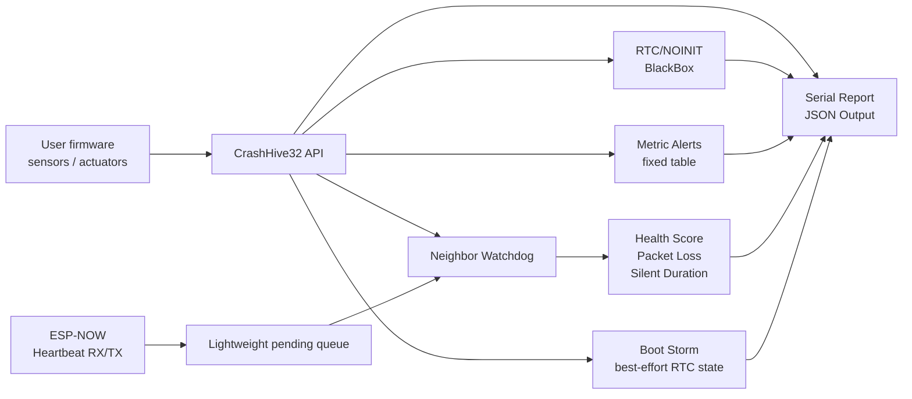

<p align="center">
  
</p>

<p align="center">
  <a href="https://www.arduino.cc/reference/en/libraries/">
    
  </a>
  <a href="library.properties">
    
  </a>
  
  <a href="LICENSE">
    
  </a>
  
</p>

<p align="center">
  <a href="https://github.com/Parvaz-Jamei/CrashHive32/actions/workflows/arduino-compile.yml">
    
  </a>
</p>

<h1 align="center">CrashHive32</h1>

<p align="center">
  <strong>ESP32 nodes that remember their last moments — and neighbors that watch closer.</strong>
</p>

CrashHive32 is a small Arduino library for **crash-aware ESP32 field diagnostics**. It combines best-effort RTC/NOINIT BlackBox logging, ESP-NOW heartbeat monitoring, neighbor silence detection, health scoring, packet loss estimates, boot storm detection, metric threshold alerts, and adaptive response callbacks.

It is designed for ESP32 Industrial IoT prototypes, edge nodes, sensor networks, and field-deployed firmware where you need lightweight observability without adding cloud, MQTT, dashboards, AI, or persistent flash logging.

---

## What CrashHive32 is not

CrashHive32 is intentionally small and honest about its limits.

It is **not**:

- a safety-certified industrial protection system
- a permanent data logger
- a full mesh routing stack
- a self-healing network system
- a cloud, MQTT, AI, dashboard, OTA, or backend framework
- an RSSI-based radio quality analyzer
- a persistent Flash/NVS/LittleFS logging layer

CrashHive32 focuses on lightweight device-side diagnostics that can run inside Arduino/ESP32 firmware with fixed-size storage and no dynamic allocation in the core diagnostic paths.

---

## Features

| Area | What it provides |
|---|---|
| Crash BlackBox | Best-effort RTC/NOINIT event memory for recent reset and diagnostic events |
| Reset diagnostics | Reset reason code/name helpers and readable reports |
| Boot storm detection | Best-effort crash-loop / reset-loop detection using RTC/NOINIT state |
| ESP-NOW heartbeat | Small heartbeat packets designed to stay under the ESP-NOW v1 250-byte payload limit |
| Neighbor watchdog | `unknown`, `alive`, `degraded`, and `silent` neighbor states |
| Neighbor health | Age, silent duration, health score, degraded state, and packet loss estimate |
| Metric alerts | Fixed-size threshold alerts for values such as temperature, voltage, current, vibration, or motor state |
| System health | Simple 0–100 diagnostic summary for application dashboards or Serial output |
| JSON output | Chunk callback export and `Stream` printing without large Arduino `String` allocation |
| Developer UX | MAC text helpers, readable state/reason helpers, and interval-based watchdog configuration |

---

## Installation

### Arduino Library Manager

CrashHive32 is available in the Arduino Library Manager.

1. Open **Arduino IDE**.
2. Go to **Sketch → Include Library → Manage Libraries...**
3. Search for **CrashHive32**.
4. Click **Install**.

Then include it in your sketch:

```cpp
#include <CrashHive32.h>
```

### Arduino CLI

```bash
arduino-cli lib install CrashHive32
```

### Manual installation

Manual installation is only needed for development builds or testing unreleased versions.

Download the ZIP from GitHub, then use:

```text
Arduino IDE → Sketch → Include Library → Add .ZIP Library...
```

---

## Hardware requirements

- ESP32 board supported by the Arduino ESP32 core
- Arduino IDE 2.x or Arduino CLI
- ESP-NOW examples require two ESP32 boards for real peer delivery
- `03_Neighbor_Watchdog` and `06_Field_Diagnostics` can demonstrate logic on one board with simulated heartbeats

---

## Quick start

```cpp
#include <CrashHive32.h>

void setup() {
  Serial.begin(115200);

  CrashHive32.begin();

  CrashHive32.recordMetric("temp", 42.5F);
  CrashHive32.printReport(Serial);
}

void loop() {
  CrashHive32.tick();
}
```

---

## Architecture



CrashHive32 keeps ESP-NOW callbacks lightweight. User callbacks are not called directly from ESP-NOW send/receive callbacks; pending heartbeat data is drained from `tick()`.

---

## Field diagnostics recipe

```cpp
#include <CrashHive32.h>

static const uint32_t MOTOR_NODE_ID = 2;

void onAdaptive(uint32_t nodeId, uint8_t reason) {
  Serial.print("node=");
  Serial.print(nodeId);
  Serial.print(" reason=");
  Serial.println(CrashHive32.getAdaptiveReasonName(reason));
}

void setup() {
  Serial.begin(115200);

  CrashHive32.begin();

  CrashHive32.watchNeighborEvery(MOTOR_NODE_ID, 5000UL); // 5 s heartbeat, 15 s timeout
  CrashHive32.onAdaptiveResponse(onAdaptive);
}

void loop() {
  CrashHive32.tick();

  if (!CrashHive32.isNeighborHealthy(MOTOR_NODE_ID)) {
    Serial.print("Motor node state=");
    Serial.println(CrashHive32.getNeighborStateName(MOTOR_NODE_ID));
  }
}
```

---

## ESP-NOW peers

CrashHive32 accepts both colon-separated and dash-separated MAC strings. Mixed separators are rejected.

```cpp
uint8_t peerMac[6] = {0x24, 0x6F, 0x28, 0xAA, 0xBB, 0x01};

CrashHive32.addPeer(peerMac);
CrashHive32.addPeer("24:6F:28:AA:BB:01");
CrashHive32.addPeer("24-6F-28-AA-BB-01");

CrashHive32.removePeer(peerMac);
CrashHive32.removePeer("24:6F:28:AA:BB:01");
```

`removePeer()` returns `true` when a known peer is removed. It returns `false` for invalid MAC text, ESP-NOW delete failure, or a peer that is not currently known.

> ESP-NOW send success means the packet was transmitted at the MAC layer. It does not guarantee that the receiving application processed the payload.

---

## Reset reason

```cpp
Serial.println(CrashHive32.getResetReasonName());

uint8_t resetCode = CrashHive32.getResetReasonCode();
```

Typical reset reason names include:

```text
power_on
external
software
panic
interrupt_watchdog
task_watchdog
watchdog
deep_sleep
brownout
sdio
unknown
```

---

## Boot storm detection

```cpp
if (CrashHive32.isBootStorm()) {
  Serial.println("Boot storm detected");
}

Serial.print("Boot streak=");
Serial.println(CrashHive32.getBootStreak());
```

Normally, let `CrashHive32.tick()` mark the boot stable automatically after `CH32_BOOT_STABLE_MS`.

```cpp
// Usually not needed:
// CrashHive32.markBootStable();
```

Only call `markBootStable()` manually after your own application-specific stability criteria have passed.

> Boot storm detection uses best-effort RTC/NOINIT memory. It is not durable across all power-loss or brownout conditions. Calling `markBootStable()` too early can hide real boot storm or crash-loop symptoms.

---

## Neighbor diagnostics

```cpp
CrashHive32.watchNeighbor(2, 15000UL);
CrashHive32.watchNeighborEvery(3, 5000UL);  // timeout = 15000 ms by default
```

### Neighbor state

```cpp
uint8_t state = CrashHive32.getNeighborState(2);

Serial.println(CrashHive32.getNeighborStateName(2));
```

State names:

| Constant | Meaning |
|---|---|
| `CH32_NEIGHBOR_UNKNOWN` | Watched, but no heartbeat has been seen yet |
| `CH32_NEIGHBOR_ALIVE` | Heartbeat received within the healthy window |
| `CH32_NEIGHBOR_DEGRADED` | Early warning before silent timeout or packet-loss issue |
| `CH32_NEIGHBOR_SILENT` | Timeout reached or expected node never appeared |

A watched neighbor stays `CH32_NEIGHBOR_UNKNOWN` during its first timeout window. If no heartbeat arrives by `timeoutMs`, it transitions to `CH32_NEIGHBOR_SILENT`, health drops to `0`, and silent/adaptive callbacks fire once.

### Neighbor age and silent duration

```cpp
uint32_t ageMs = CrashHive32.getNeighborAgeMs(2);
uint32_t silentMs = CrashHive32.getNeighborSilentMs(2);
```

### Health score

Use the safe overload when you need to distinguish unknown from unhealthy:

```cpp
uint8_t health = 0;

if (CrashHive32.getNeighborHealth(2, &health)) {
  Serial.println(health);
} else {
  Serial.println("Health is not available yet");
}
```

For simple logic:

```cpp
if (!CrashHive32.isNeighborHealthy(2)) {
  Serial.println("Node 2 needs attention");
}
```

Health score meaning:

| Value | Meaning |
|---:|---|
| `100` | Excellent |
| `70–99` | Healthy |
| `40–69` | Degraded |
| `1–39` | Critical |
| `0` | Unknown, missing, dead, or silent too long |

Recommended timeout: set `timeoutMs` to at least **2.5× to 3×** the expected heartbeat interval to avoid treating normal late heartbeats as degraded.

### Packet loss estimate

```cpp
uint8_t lossPercent = CrashHive32.getNeighborPacketLoss(2);
```

Packet loss is estimated from heartbeat sequence gaps. It is a lightweight diagnostic estimate, not a radio-layer measurement.

---

## Metric threshold alerts

```cpp
void onTempAlert(const char* key, float value, float minValue, float maxValue) {
  Serial.print("[ALERT] ");
  Serial.print(key);
  Serial.print(" value=");
  Serial.print(value);
  Serial.print(" range=");
  Serial.print(minValue);
  Serial.print("..");
  Serial.println(maxValue);
}

void setup() {
  Serial.begin(115200);

  CrashHive32.begin();
  CrashHive32.setMetricAlert("motor_temp", 0.0F, 70.0F, onTempAlert);
}

void loop() {
  CrashHive32.tick();

  CrashHive32.recordMetric("motor_temp", 72.0F);
}
```

Alerts fire once per out-of-range episode and reset only after the metric returns to the configured range.

Metric alert keys use the same canonicalization as BlackBox keys:

- valid characters: `a-z A-Z 0-9 _ - .`
- invalid characters become `_`
- keys that would exceed the visible key length limit are rejected for metric alerts

---

## System health

```cpp
uint8_t systemHealth = CrashHive32.getSystemHealth();

if (CrashHive32.hasActiveDiagnosticWarning()) {
  Serial.println("Diagnostic warning active");
}
```

System health is a simple 0–100 summary derived from boot storm state, reset reason, neighbor health, and active metric alerts.

---

## JSON output

Use one JSON output method at a time:

```cpp
CrashHive32.printJson(Serial);
```

For custom sinks:

```cpp
void writeChunk(const char* chunk) {
  Serial.print(chunk);
}

CrashHive32.exportJson(writeChunk);
```

| Method | Best for |
|---|---|
| `printJson(Stream&)` | `Serial`, file-like streams, simple debugging |
| `exportJson(writer)` | custom sinks, chunked transport, gateways |

Neither method builds a large Arduino `String` internally.

---

## Callback model

```cpp
void onSilent(uint32_t nodeId) {
  Serial.print("silent node=");
  Serial.println(nodeId);
}

void onRecovered(uint32_t nodeId) {
  Serial.print("recovered node=");
  Serial.println(nodeId);
}

void onAdaptive(uint32_t nodeId, uint8_t reason) {
  Serial.print("adaptive node=");
  Serial.print(nodeId);
  Serial.print(" reason=");
  Serial.println(CrashHive32.getAdaptiveReasonName(reason));
}

void setup() {
  CrashHive32.onNeighborSilent(onSilent);
  CrashHive32.onNeighborRecovered(onRecovered);
  CrashHive32.onAdaptiveResponse(onAdaptive);
}
```

| Callback | Purpose |
|---|---|
| `onNeighborSilent()` | Exact silent transition |
| `onNeighborRecovered()` | Exact recovery transition |
| `onAdaptiveResponse()` | Higher-level adaptive behavior with reason code |

Adaptive reason names:

| Reason | Name |
|---|---|
| `CH32_ADAPTIVE_REASON_NEIGHBOR_SILENT` | `neighbor_silent` |
| `CH32_ADAPTIVE_REASON_NEIGHBOR_RECOVERED` | `neighbor_recovered` |
| `CH32_ADAPTIVE_REASON_NEIGHBOR_DEGRADED` | `neighbor_degraded` |
| `CH32_ADAPTIVE_REASON_NEIGHBOR_HEALTHY` | `neighbor_healthy` |

---

## Public API

### Core

```cpp
bool begin();
bool tick();
```

### BlackBox

```cpp
bool recordMetric(const char* key, float value);
bool recordFlag(const char* key, int code);

bool hasPreviousEvents() const;
void printReport(Stream& out) const;
bool exportJson(CH32ChunkWriter writer) const;
void printJson(Stream& out) const;
```

### Reset and boot

```cpp
uint8_t getResetReasonCode() const;
const char* getResetReasonName() const;

bool isBootStorm() const;
uint8_t getBootStreak() const;
void markBootStable();
```

### ESP-NOW

```cpp
bool beginEspNow();

bool addPeer(const uint8_t mac[6]);
bool addPeer(const char* mac);

bool removePeer(const uint8_t mac[6]);
bool removePeer(const char* mac);

bool sendHeartbeat(uint32_t nodeId, uint8_t status);
void setHeartbeatInterval(uint32_t intervalMs);
```

### Neighbor watchdog

```cpp
bool watchNeighbor(uint32_t nodeId, uint32_t timeoutMs);
bool watchNeighborEvery(uint32_t nodeId,
                        uint32_t expectedHeartbeatMs,
                        uint8_t missedBeats = 3U);

bool removeNeighbor(uint32_t nodeId);
bool noteHeartbeat(uint32_t nodeId);

uint8_t getNeighborState(uint32_t nodeId) const;
const char* getNeighborStateName(uint32_t nodeId) const;

uint32_t getNeighborAgeMs(uint32_t nodeId) const;
uint32_t getNeighborSilentMs(uint32_t nodeId) const;

uint8_t getNeighborHealth(uint32_t nodeId) const;
bool getNeighborHealth(uint32_t nodeId, uint8_t* outHealth) const;
bool isNeighborHealthy(uint32_t nodeId, uint8_t minHealth = 70U) const;

bool isNeighborDegraded(uint32_t nodeId) const;
uint8_t getNeighborPacketLoss(uint32_t nodeId) const;
```

### Callbacks

```cpp
void onNeighborSilent(CH32NeighborCallback callback);
void onNeighborRecovered(CH32NeighborCallback callback);

void onAdaptiveResponse(CH32AdaptiveCallback callback);
const char* getAdaptiveReasonName(uint8_t reason) const;
```

### Metric alerts

```cpp
bool setMetricAlert(const char* key,
                    float minValue,
                    float maxValue,
                    CH32MetricAlertCallback callback);

bool clearMetricAlert(const char* key);
void clearMetricAlerts();
```

### System health

```cpp
uint8_t getSystemHealth() const;
bool hasActiveDiagnosticWarning() const;
```

---

## API notes

- `recordFlag(name, code)`: `code` is stored as an 8-bit value. Values below `0` are clipped to `0`; values above `255` are clipped to `255`.
- `sendHeartbeat(nodeId, status)`: `status` is an application-defined 8-bit value. CrashHive32 does not impose a fixed status enum in v1.1.1.
- To preserve a full `uint32_t nodeId`, use neighbor APIs and Serial output. The BlackBox flag code is small status/code data, not a full node ID store.
- `getNeighborHealth(nodeId)` returns a simple 0–100 value. Use `getNeighborHealth(nodeId, &health)` when you need to know whether the value is available.
- MAC text helpers require exactly `XX:XX:XX:XX:XX:XX` or `XX-XX-XX-XX-XX-XX`.

---

## Examples

| Example | Description |
|---|---|
| `01_BlackBox_Basic` | Basic BlackBox usage and JSON/report output |
| `02_Heartbeat_Monitor` | ESP-NOW peer registration and heartbeat send |
| `03_Neighbor_Watchdog` | Simulated heartbeat watchdog |
| `04_Full_Demo_Three_Nodes` | Three-node conceptual demo |
| `06_Field_Diagnostics` | Single-board simulated diagnostics: reset reason, boot storm, metric alert, UNKNOWN-to-SILENT transition, recovery, health, packet loss, and JSON |

Open examples from:

```text
Arduino IDE → File → Examples → CrashHive32
```

---

## Validation status

CrashHive32 is available through the Arduino Library Manager and is structured as a standard Arduino library.

Before claiming hardware-validated use in your own project, test on your target board and document:

| Item | Status |
|---|---|
| Board model | To be filled by integrator |
| Arduino ESP32 core version | To be filled by integrator |
| Examples tested | To be filled by integrator |
| Serial Monitor evidence | To be filled by integrator |
| ESP-NOW two-board delivery | PASS / PARTIAL / NOT TESTED |
| Date | YYYY-MM-DD |

Hardware behavior depends on board, power quality, reset reason, ESP32 core version, and RF environment.

---

## Limitations

- RTC/NOINIT memory is best-effort only and is not durable across all power-loss or brownout conditions.
- CrashHive32 is not a permanent data logger.
- CrashHive32 is not safety-certified.
- ESP-NOW send callback indicates MAC-layer send status, not guaranteed application-level delivery.
- Packet loss is estimated from received sequence gaps.
- No RSSI scoring in this version.
- No full mesh routing.
- No self-healing network claim.
- No persistent Flash/NVS/LittleFS logging.
- No cloud, MQTT, AI, dashboard, OTA, backend, or web server.
- Hardware validation must be performed by the integrator for the target board and deployment environment.

---

## Project structure

```text
CrashHive32/
├── README.md
├── LICENSE
├── CHANGELOG.md
├── CONTRIBUTING.md
├── CODE_OF_CONDUCT.md
├── SECURITY.md
├── library.properties
├── keywords.txt
├── src/
│   ├── CrashHive32.h
│   ├── CrashHive32.cpp
│   └── internal/
├── examples/
│   ├── 01_BlackBox_Basic/
│   ├── 02_Heartbeat_Monitor/
│   ├── 03_Neighbor_Watchdog/
│   ├── 04_Full_Demo_Three_Nodes/
│   └── 06_Field_Diagnostics/
├── docs/
└── .github/
    └── workflows/
        └── arduino-compile.yml
```

Only `src/CrashHive32.h` is intended as the public include header.

---

## Contributing

Contributions are welcome, especially:

- compile checks on different ESP32 boards
- documentation improvements
- small Arduino-friendly examples
- bug reports with board/core/version details

Please avoid proposals that expand CrashHive32 into cloud, MQTT, AI, dashboards, full mesh routing, OTA, or persistent flash logging unless they are clearly scoped as separate optional projects.

See [CONTRIBUTING.md](CONTRIBUTING.md).

---

## Security

Please report security concerns privately to:

```text
parvaz.nic@gmail.com
```

See [SECURITY.md](SECURITY.md).

---

## Changelog

Initial public release summary:

- ESP32 RTC/NOINIT crash BlackBox
- ESP-NOW heartbeat monitoring
- Neighbor watchdog and health scoring
- Metric alerts
- Boot storm detection
- Field diagnostics example
- Arduino examples and documentation

See [CHANGELOG.md](CHANGELOG.md).

---

## License

MIT License — see [LICENSE](LICENSE) for details.

<p align="center">
  
</p>
